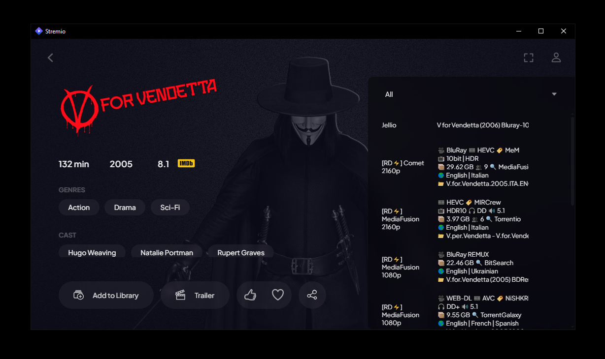
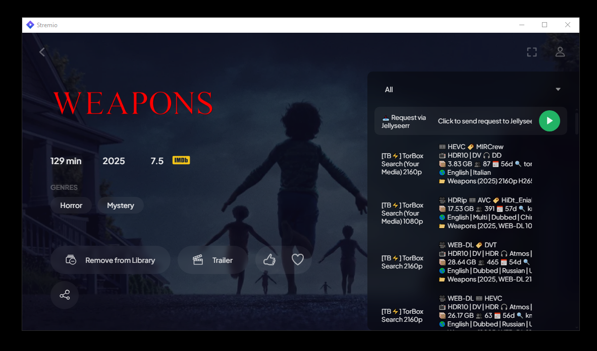

# Jellio++
[](https://github.com/wujekbogdan/jellio-plus-plus/releases)

Stream your Jellyfin library directly in Stremio with seamless integration.

**Jellio++** is a fork of a fork:

- [**Jellio**](https://github.com/vanchaxy/jellio) by [Vanchaxy](https://github.com/vanchaxy) - the original Jellyfin↔Stremio bridge.
- [**Jellio+**](https://github.com/InfiniteAvenger/jellio-plus) by [InfiniteAvenger](https://github.com/InfiniteAvenger) - fork adding Jellyfin 10.11.x support.
- **Jellio++** - this fork. Adds HLS streaming with proper seeking, OpenSubtitles hashes for subtitle matching, public base URL support, and a few other fixes upstream hasn't taken yet.

Every fork gets another `+`. We don't make the rules.

## Features

- **Full Library Integration** - Access your entire Jellyfin movie and TV show collection in Stremio
- **Cross-Platform** - Works on all Stremio-supported devices (Windows, macOS, Linux, Android, iOS)
- **Jellyseerr Integration** - Optional integration with Jellyseerr for content requests
- **Multiple Formats** - Supports various video codecs and quality options.

## How it Works:

### Browsing Your Library in Stremio

Jellio++ allows you to instantly stream media from your Jellyfin server through Stremio. Simply search for the media in Stremio, and if it is on your Jellyfin server, it will appear!



### Jellyseerr Integration

Enable the optional Jellyseerr functionality to be able to directly request media to be sent to Jellyseerr with a simple in-app solution.



### Installation:

NOTICE: Your Jellyfin instance needs to be reachable over HTTPS because Stremio requires HTTPS for addon URLs. You need an HTTPS tunnel such as Cloudflare Tunnel, Tailscale Funnel, ngrok, etc.

1. Open Jellyfin Dashboard > Plugins > Manage Repositories
2. Click "New Repository" and add "Jellio++" for the name, and "https://raw.githubusercontent.com/wujekbogdan/jellio-plus-plus/metadata/jellyfin-repo-manifest.json" for the repository url
3. Go back to Plugins, and under "All" find and install Jellio++
4. Restart Jellyfin
5. Jellyfin Dashboard > Plugins > Installed > Jellio++ and then click "Settings"
6. Select which libraries you want to be included in Stremio
7. (Optional) Input your local Jellyseerr url (e.g. http://192.168.0.105:5055) and your Jellyseerr API key. Also include your Public URL for Jellyfin (e.g. https://jellyfin.yourserver.com)
8. Click "Save Configuration for Jellyfin"
9. Lastly, click "Install." Copy that link and paste it in your Stremio addons. You're all done!

## Development

### Backend stack

Build the plugin and start Jellyfin + Stremio:

```bash
docker compose run --rm dotnet-builder
docker compose up -d
```

Jellyfin: http://localhost:8096. Stremio: http://localhost:11470. Test media goes in `./media/`.

### Plugin UI

```bash
cd jellio-web
npm install
npm run dev
```

Served at http://localhost:5173/jelliopp/. All API calls are mocked with MSW; the UI does not connect to any backend.
